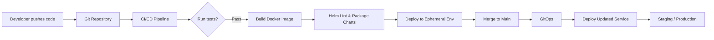

# Release Demo: Accelerating Deployments & Enhancing Test Reliability

This project is a hands-on demonstration of how to improve a software release process by addressing two core problems:

1. **Slow Deployment Sync Times:** A monolithic Helm chart (100K+ lines) causes delays because syncing takes several minutes, blocking rapid iteration.
2. **Unreliable, Manual Testing:** Manual tests are flaky, slow, and demotivating, which results in longer verification times and lower confidence in releases.

My solution leverages a modular architecture using independent Go microservices, separate Helm charts, and a robust CI/CD pipeline integrated with GitOps practices. This approach not only speeds up deployment by isolating services but also replaces manual tests with automated, reliable testing.


## Table of Contents

- [Project Overview](#project-overview)
- [Problem Statement](#problem-statement)
- [Proposed Solution](#proposed-solution)
- [Architecture & Design](#architecture--design)
- [Project Structure](#project-structure)
- [How It Demonstrates the Solution](#how-it-demonstrates-the-solution)
- [Running the Project Locally](#running-the-project-locally)


## Project Overview

This repository contains two independent Go microservices:
- **Service-A**
- **Service-B**

Each service is:
- **Containerized** using Docker.
- **Deployed** via its own modular Helm chart.
- **Built and Tested** using a comprehensive CI/CD pipeline (via GitHub Actions).

The modular approach demonstrates how you can break down a monolithic Helm deployment into smaller, independently deployable components. It also shows how automation in testing can be integrated into the build and deployment pipeline, eliminating the need for time-consuming and unreliable manual tests.


## Problem Statement

In this scenario development team faces two critical challenges:

1. **Monolithic Helm Chart:**  
   - A single 100K+ line Helm chart is used to deploy all services.
   - This causes long sync times (several minutes) for every change, forcing engineers to wait before they can continue iterating.

2. **Manual Testing Woes:**  
   - Manual tests are error-prone, flaky, and boring to write.
   - The resulting delays in verification slow down the release cycle and erode trust in the testing process.


## Proposed Solution

My solution consists of three main components:

1. **Modularization of Deployments:**
   - **Separate Helm Charts:** Each microservice (Service-A and Service-B) has its own Helm chart. This dramatically reduces sync time because changes in one service do not trigger the re-deployment of an entire monolithic chart.
   - **Independent GitOps:** Using a GitOps tool (such as ArgoCD), only the modified microservice is deployed. This ensures quick, reliable updates.

2. **Robust CI/CD Pipeline:**
   - **Automated Build & Test:** The CI/CD pipeline automatically builds each service, runs unit tests, and builds Docker images.
   - **Helm Linting:** Validates the correctness of the Helm charts before deployment.
   - **Optional Ephemeral Environments:** Although not fully implemented here, the design allows the deployment of pull requests to temporary Kubernetes namespaces for full end-to-end testing.

3. **Automated Testing:**
   - **Unit Tests and Integration Tests:** Written in Go, these tests run on every commit to catch regressions early.
   - **Reduction of Manual Testing:** By automating tests, the pipeline provides fast feedback, reducing reliance on manual testing and increasing developer confidence.

---

## Architecture & Design

### High-Level Workflow

Below is a diagram illustrating our end-to-end workflow:



### Key Design Decisions

-   **Modular Helm Charts:** By breaking the monolithic Helm chart into smaller charts, each service can be updated independently, significantly reducing deployment sync times.
    
-   **Dedicated CI/CD Pipeline:** Automated testing, building, and Docker image creation for each service ensure that changes are validated quickly.
    
    


## Project Structure

```
release-demo/
├── service-a/
│   ├── main.go
│   ├── main_test.go
│   ├── go.mod
│   └── Dockerfile
├── service-b/
│   ├── main.go
│   ├── main_test.go
│   ├── go.mod
│   └── Dockerfile
├── helm/
│   ├── service-a/
│   │   ├── Chart.yaml
│   │   ├── values.yaml
│   │   └── templates/
│   │       ├── _helpers.tpl
│   │       ├── deployment.yaml
│   │       └── service.yaml
│   └── service-b/
│       ├── Chart.yaml
│       ├── values.yaml
│       └── templates/
│           ├── _helpers.tpl
│           ├── deployment.yaml
│           └── service.yaml
├── .github/
│   └── workflows/
│       └── ci.yml
└── README.md` 
```

Each folder is dedicated to a specific component of the solution:

-   **Service Directories:** Contain the source code, tests, and Docker configuration for each microservice.
    
-   **Helm Directory:** Contains independent Helm charts for each service.
    
-   **GitHub Actions Workflow:** Defines the CI/CD pipeline that builds, tests, and lints the project.
    


## How It Demonstrates the Solution

### Faster Deployments

-   **Modular Helm Charts:** Instead of one monolithic chart, each service is deployed via its own Helm chart. When changes are made to Service-A, only Service-A’s chart is synced and deployed, reducing wait times.
    
-   **GitOps-Driven Deployment:** A GitOps tool (e.g., ArgoCD) can monitor the Git repository and automatically update only the changed services, streamlining deployments and reducing downtime.
    

### Improved Testing Reliability

-   **Automated Testing:** Each service includes a set of unit tests that run in the CI/CD pipeline, ensuring that code changes are validated quickly. This replaces tedious manual testing with reliable, automated tests.
    
-   **CI/CD Integration:** The GitHub Actions workflow executes tests, builds Docker images, and performs Helm linting automatically on every commit or pull request. This guarantees that any issue is caught early in the development cycle.
    

### Enhanced Developer Experience

-   **Quick Feedback Loop:** With fast, automated testing and independent deployments, developers get rapid feedback on their changes, leading to higher confidence and productivity.
    
-   **Scalability:** As the project grows, more services can be added following the same modular approach. Each microservice remains isolated, meaning that updates to one service do not impact the others.
    

### Practical Demonstration

-   **Local Development:** Developers can run each microservice locally, run tests, and simulate deployments using Docker and Helm.
    
-   **CI/CD Pipeline:** The provided GitHub Actions configuration demonstrates how continuous integration and delivery can be achieved, serving as a template for production systems.
    
   


## Running the Project Locally

### For Service-A:

1.  **Navigate to the service directory:**
    

    
    `cd service-a` 
    
2.  **Run the service:**
    
    `go run main.go` 
    
    Access http://localhost:8080/hello to see the greeting.
    
3.  **Run tests:**

    
    `go test -v ./...` 
    

### For Service-B:

1.  **Navigate to the service directory:**

    
    `cd service-b` 
    
2.  **Run the service:**
    

    
    `go run main.go` 
    
    Access http://localhost:8081/hello to see the greeting.
    
3.  **Run tests:**
    

    
    `go test -v ./...` 
    

### Docker and Helm Deployment

-   **Build Docker Images:**
    
   ```    
    docker build -t example/service-a:latest ./service-a
    docker build -t example/service-b:latest ./service-b` 
   ```
    
-   **Deploy via Helm:** Ensure you have a running Kubernetes cluster and Helm installed.
   ```    
   helm install service-a ./helm/service-a
   helm install service-b ./helm/service-b
 ```